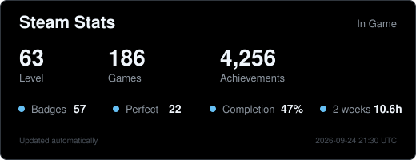

<h1 align="center">SemyaN1el</h1>

<table width="100%">
<tr>
<td width="50%" align="center" valign="top">

</td>
<td width="50%" align="center" valign="top">

</td>
</tr>
<tr>
<td width="50%" align="center" valign="top">

</td>
<td width="50%" align="center" valign="top">

</td>
</tr>
<tr>
<td colspan="2" align="center">

</td>
</tr>
</table>
